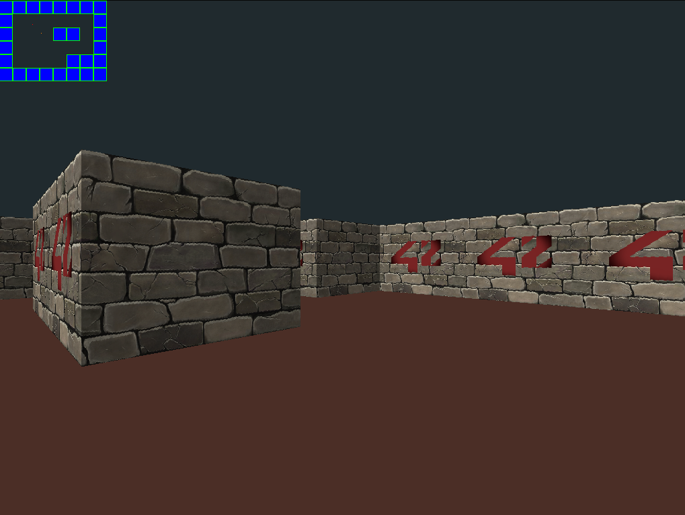
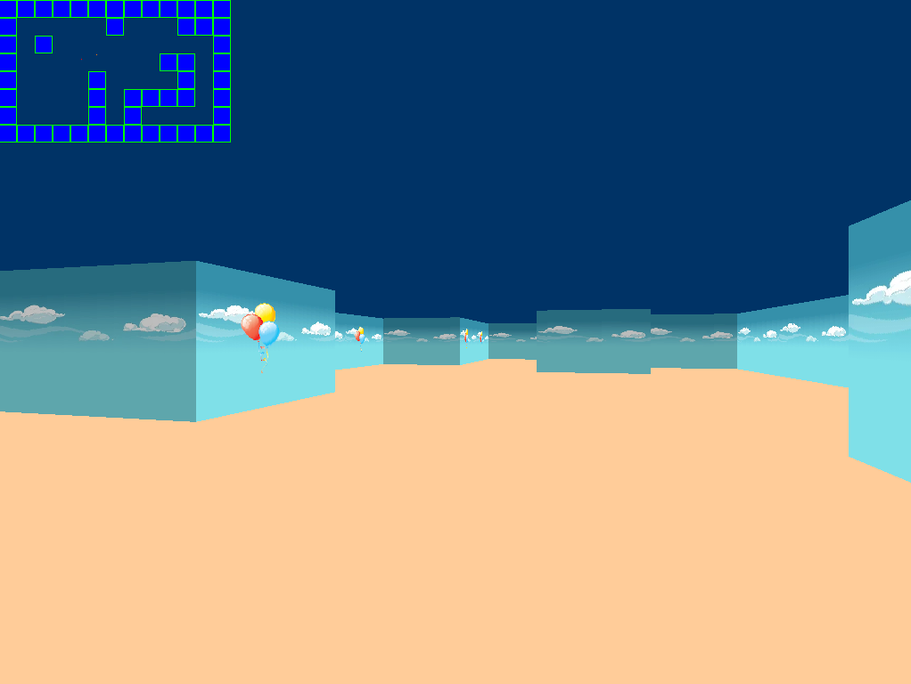

# cub3D
 
## Plan
#### 1 - Objectif du projet
#### 2 - Lancement du programme
#### 3 - Fonctionnement du programme
## 
### 1 - Objectif du projet
Cub3D fait partie des projets de l'école 42 et consiste à recréer un mini moteur graphique permettant d'afficher un monde 3D à partir d'une map en 2D et d'un jeu de textures qui seront appliquées sur les murs. L'affichage en 3D est basé sur un algorithme de raycasting.
Ce projet est réalisé en langage C et utilise la minilibX qui est une bibliothèque permettant l'affichage de pixels sur une fenêtre graphique.

### 2 - Lancement du programme
La compilation se fait à l'aide du Makefile avec la commande : 
```
make -j
```
L'exécution se fait en spécifiant le nom de la map à lancer en argument du programme, par exemple :
```
./cub3D ./maps/valid_maps/10_medium_map_sky_texture.cub
```
### 3 - Fonctionnement du programme
#### 3.1 - Lecture et formatage de la map
La map au format *.cub permet de définir les points suivants :
- les textures (fichiers *.xpm) utilisées pour les murs. La texture appliquée au mur diffère en fonction de son orientation nord, sud, est, ouest.
- la couleur du sol et du ciel avec un entier par couleur RGB.
- la map sur laquelle évolura le joueur. Les char utilisés pour definir la map sont :
  - 0 ou 1 pour indiquer un espace vide ou un mur
  - N, S, E ou W pour indiquer la position de départ du joueur. La lettre indique la direction vers laquelle le joueur regarde au lancement du jeu
- Voici un exemple de map utilisée :
```    
11111111
10000001
10001101
10E00001
11111111
```
Le programme final est capable de parser le fichier et détecter les cas d'erreurs possible sur le fichier (informations manquantes, carte invalide...)
#### 3.2 - Gestion des textures
La MLX permet de convertir les images xpm en un format 'image' propre à la bibliothèque permettant une récupération facile de la couleur d'un pixel en fonction de sa position (x, y) dans l'image.
#### 3.3 - Raycasting
Pour représenter un monde en trois dimensions à partir d'une carte en deux dimensions un algorithme de raycasting est utilisé. La méthode consiste à balayer angulairement le champs de vision du joueur pour 'scanner' la carte en face de lui et déterminer la distance des murs.
Pour cela des rayons espacés angulairement sont créés (un rayon par colonne de pixel de la fenêtre de jeu). Pour une fenêtre de 1024 pixel par exemple, 1024 rayons seront créés. Pour chaque rayon partant du joueur, on calcule ensuite la distance du 1er mur impacté. L'algorithme de raycasting permet d'optimiser les calculs et maximiser les performances du jeu. Une fois la distance calculée, il est possible de connaître la hauteur du mur vu dans cette direction (inversement proportionnelle à la distance duu mur) et ainsi dessiner le mur sur la fenêtre sur la colonne de pixel correspondante.
#### 3.4 - Mapping des texture
Pour mapper les texture, il suffit de connaître à quelle pourcentage de hauteur et de largeur du mur le rayon a croisé le mur pour aller chercher dans la texture la couleur du pixel correspondant.
#### 3.5 - Gestion des évènements (hooks)
La MLX permet de gérer différent événements comme la pression des touches du clavier. Cela permet de changer la position du joueur et son orientation en fonction de la touche pressée.
#### 3.6 - Fin du programme
Le programme se termine si la map est invalide ou en cas d'exit demandée par le joueur. Avant de terminer l'execution, la mémoire allouée est libérée.
